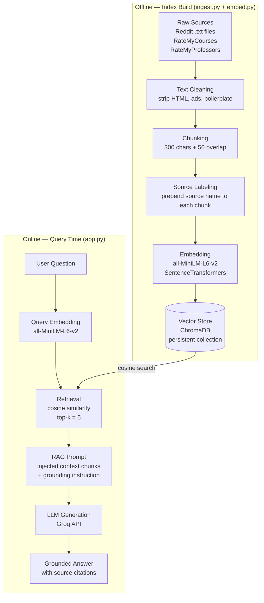

# Project 1 Planning: The Unofficial Guide

> Write this document before you write any pipeline code.
> Your spec and architecture diagram are what you'll use to direct AI tools (Claude, Copilot, etc.) to generate your implementation — the more specific they are, the more useful the generated code will be.
> Update the Retrieval Approach and Chunking Strategy sections if you change your approach during implementation.
> Update this file before starting any stretch features.

---

## Domain

Computer Science Course Advice

---

## Documents

<!-- List your specific sources: URLs,  subreddit names, forum threads, or file descriptions.
     Aim for at least 10 sources that together cover different subtopics or perspectives within your domain. -->

| #   | Source                                             | Description                                                      | URL or location                                            |
| --- | -------------------------------------------------- | ---------------------------------------------------------------- | ---------------------------------------------------------- |
| 1   | Reddit r/learnprogramming                          | Discussion on recommended CS courses and learning order.         | https://www.reddit.com/r/learnprogramming/comments/fls11e  |
| 2   | Reddit r/learnprogramming                          | Advice on building a strong CS foundation.                       | https://www.reddit.com/r/learnprogramming/comments/1n23o6a |
| 3   | Reddit r/learnprogramming                          | Advice for students preparing for Data Structures.               | https://www.reddit.com/r/learnprogramming/comments/dx206v  |
| 4   | Reddit r/compsci                                   | Discussion about what an ideal intro CS course should teach.     | https://www.reddit.com/r/compsci/comments/hh8ijq           |
| 5   | COP 3502C (Computer Science I) reviews             | Student opinions on workload, exams, and learning outcomes.      | https://www.ratemycourses.io/ucf/course/cop3502c           |
| 6   | COP 3503C (Computer Science II) reviews            | Student feedback on instruction quality and course difficulty.   | https://www.ratemycourses.io/ucf/course/cop3503c           |
| 7   | CSC 241 Introduction to Computer Science I reviews | Student advice about professors and course foundations.          | https://www.ratemycourses.io/depaul/course/csc241          |
| 8   | Professor reviews (Craig Kapp, NYU)                | Student comments on teaching quality and engagement.             | https://www.ratemyprofessors.com/professor/1579749         |
| 9   | Professor reviews (Keith Decker, Delaware)         | Student comments on practice problems and course rigor.          | https://www.ratemyprofessors.com/professor/540363          |
| 10  | Professor reviews (Karen Mazidi, UT Dallas)        | Student feedback on lectures, assignments, and exam preparation. | https://www.ratemyprofessors.com/professor/2190788         |

---

## Chunking Strategy

<!-- How will you split documents into chunks?
     State your chunk size (in tokens or characters), overlap size, and explain why those
     numbers fit the structure of your documents.
     A review-heavy corpus warrants different chunking than a long FAQ. -->

**Chunk size:** 300 characters

**Overlap:** 50 characters

**Reasoning:** My corpus consists primarily of short student reviews, Reddit discussions, and course advice posts. These documents typically contain concise opinions about course difficulty, workload, professor quality, and career relevance. A chunk size of 300 characters preserves enough context to keep related ideas together while remaining small enough for precise retrieval. A 50-character overlap helps prevent important information from being lost when a key point falls near the boundary between two chunks. This approach balances semantic context and retrieval accuracy better than very small chunks, which can fragment student opinions, or very large chunks, which may combine unrelated topics.

---

## Retrieval Approach

<!-- Which embedding model are you using (e.g., all-MiniLM-L6-v2 via sentence-transformers)?
     How many chunks will you retrieve per query (top-k)?
     If you were deploying this for real users and cost wasn't a constraint, what tradeoffs
     would you weigh in choosing a different embedding model — context length, multilingual
     support, accuracy on domain-specific text, latency? -->

I am using the all-MiniLM-L6-v2 model via Sentence Transformers with a top-k of 5. I chose this model because it provides strong semantic search performance while being lightweight, fast, and easy to run locally — well-suited for a small corpus of student reviews, Reddit discussions, and course advice documents. For a production system with a larger knowledge base, I would consider more powerful models such as BAAI's BGE-large or OpenAI's text-embedding models, which may provide better retrieval accuracy when dealing with nuanced student opinions, longer documents, and more complex queries. The tradeoffs would include higher computational costs, increased latency, and greater infrastructure requirements. I would also weigh multilingual support if the system needed to serve students in multiple languages, and context length limits if documents contained longer forum threads or extended discussions.

---

## Evaluation Plan

<!-- List your 5 test questions with their expected correct answers.
     Questions should be specific enough that you can judge whether the system's response
     is right or wrong. "What are good dining halls?" is too vague.
     "What do students say about wait times at [dining hall name] during lunch?" is testable. -->

| #   | Question                                                                         | Expected answer                                                                                                                     |
| --- | -------------------------------------------------------------------------------- | ----------------------------------------------------------------------------------------------------------------------------------- |
| 1   | What do students say about the difficulty of COP 3502C?                          | Students describe it as a steep learning curve with a fast pace requiring daily practice, but fair grading and vital for the field. |
| 2   | What advice do students give for preparing for a Data Structures course?         | Practice coding daily, start projects early, and review prerequisite material like discrete math and basic algorithms.              |
| 3   | What is Professor Decker's teaching style like according to students?            | Students say he gives a lot of practice problems that help concepts click, though the courses are challenging overall.              |
| 4   | What do students recommend as the best first course to take in computer science? | CS50 is most frequently recommended as the best starting point, praised for its depth and teaching quality.                         |
| 5   | How do students describe the workload in COP 3503C?                              | Students describe it as manageable but assignment-heavy, with programming assignments that are challenging but doable.              |

---

## Anticipated Challenges

<!-- What could go wrong? Name at least two specific risks with reasoning.
     Consider: noisy or inconsistent documents, missing source attribution, off-topic
     retrieval, chunks that split key information across boundaries. -->

Several potential failure modes may arise in this RAG system.

1.  First, the underlying corpus of student-generated content is inherently noisy and may contain contradictory or subjective assessments of the same courses, which can reduce the reliability and consistency of generated responses.

2.  Second, retrieval errors may occur when semantically similar but contextually irrelevant chunks are selected, leading to off-topic or partially relevant information being incorporated into the final answer.

3.  Third, improper chunking may result in the fragmentation of semantically coherent information across multiple segments, thereby limiting the model’s ability to access complete contextual signals necessary for accurate interpretation

4.  Finally, even when relevant passages are correctly retrieved, the generation model may fail to strictly adhere to the provided context, resulting in weak grounding or the introduction of unsupported claims.

---

## Architecture

<!-- Draw a diagram of your pipeline showing the five stages:
     Document Ingestion → Chunking → Embedding + Vector Store → Retrieval → Generation
     Label each stage with the tool or library you're using.
     You can use ASCII art, a Mermaid diagram, or embed a sketch as an image.
     You'll use this diagram as context when prompting AI tools to implement each stage. -->

---

## AI Tool Plan

<!-- For each part of the pipeline below, describe:
     - Which AI tool you plan to use (Claude, Copilot, ChatGPT, etc.)
     - What you'll give it as input (which sections of this planning.md, which requirements)
     - What you expect it to produce
     - How you'll verify the output matches your spec

     "I'll use AI to help me code" is not a plan.
     "I'll give Claude my Chunking Strategy section and ask it to implement chunk_text()
     with my specified chunk size and overlap" is a plan. -->

**Milestone 3 — Ingestion and chunking:**
I will give Claude my _Documents_ section (the 10 sources: Reddit threads from r/learnprogramming and r/compsci, RateMyCourses reviews for COP 3502C, COP 3503C, and CSC 241, and RateMyProfessors reviews for Kapp, Decker, and Mazidi) along with my _Chunking Strategy_ section (300-character chunks, 50-character overlap). I will ask it to implement a `load_documents()` function that reads plain text files and a `chunk_text()` function that splits text using those exact parameters. I will verify by printing a few chunks from a sample review and confirming chunk lengths and overlap boundaries match the spec.

**Milestone 4 — Embedding and retrieval:**
I will give Claude my _Retrieval Approach_ section specifying all-MiniLM-L6-v2 via Sentence Transformers and top-k of 3, and ask it to implement `embed_chunks()` and `retrieve_top_k()` functions backed by a FAISS or Chroma vector store. I will verify by running the five questions from my _Evaluation Plan_ against the vector store and checking that the returned chunks are drawn from relevant sources (e.g., a question about Data Structures should surface chunks from the Reddit or course review documents, not unrelated professor reviews).

**Milestone 5 — Generation and interface:**
I will give Claude my _Architecture_ diagram and the grounding requirement — that answers must cite retrieved chunks and not go beyond the documents. I will ask it to implement a RAG prompt template that injects the top-3 retrieved chunks as context and instructs the model to answer only from that context. I will verify using the same 5 evaluation questions by checking that each response references specific content from the retrieved chunks and does not introduce claims unsupported by the source documents.
